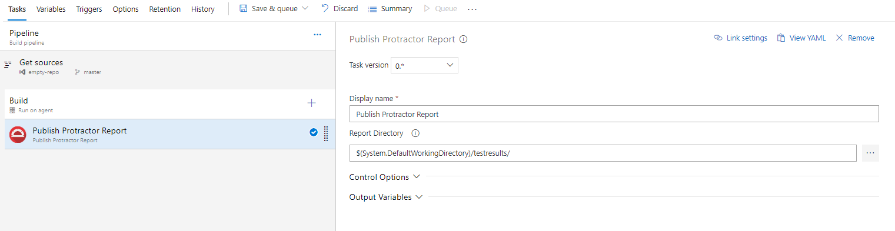
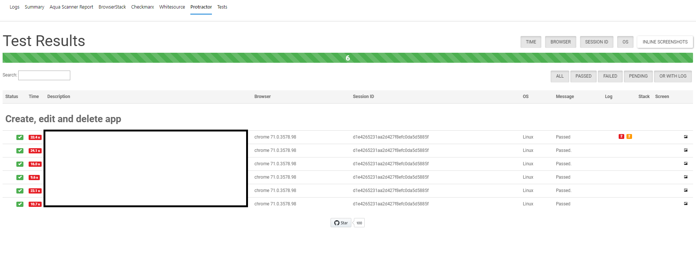

# Protractor Report Tab for Azure Pipelines

This repository contains the source code of Azure DevOps extension for publishig Protractor Report on Build and <del>Release</del> tabs.

The extension relies heavily on :heart: [Protractor Beautiful Reporter](https://www.npmjs.com/package/protractor-beautiful-reporter) :heart:, which is so cool that we decided to use it instead of building our own.

## Configuration
In order to see report on Protractor Tab one must first use `Publish Protractor Report` task. This is supporting task which makes Protractor tab visible.

This task takes one parameter `Report Directory` which is a path to Protractor Report directory. The report directory must contain `combined.json` file which is a source of the data displayed in the report. We also check content of `screenshots` directory for associated screenshots. All of the files are uploaded as attachments.

## Usage Examples

